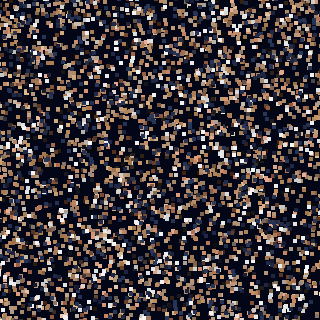

<div align="center">


<br>



<br><br>


<br><br>


<br><br>

✨ **[Try the interactive version →](https://gireeshvpai2007-maker.github.io/particle-intro)**

</div>

---

# 👋 Hello, I'm Gireesh

```cpp
class Gireesh {
public:
    string role = "Software Engineer in Progress";
    string university = "MIT Manipal";
    string degree = "B.Tech Computer Science";
    vector<string> languages = {"Java", "C++", "Python", "JavaScript", "SQL"};
    string mission = "Build software that solves real-world problems.";
};
```

---

# 💡 About Me

🎓 Computer Science student at **MIT Manipal**
💻 Passionate about Software Engineering and problem-solving
🌳 Practicing Data Structures & Algorithms consistently, working toward placements
🚀 Building real projects to apply what I learn, not just tutorials

---

# 🚀 Featured Projects

<table>
<tr>
<td width="50%" valign="top">

## ☕ StreamVault — Media Library & Watchlist System

A Java console application demonstrating generics, the Stream API, and composition through a working media-recommendation engine. Tracks per-user watchlists, computes rating analytics, and generates personalized genre-based recommendations for multiple users.

**Concepts:** Generics · Inheritance · Polymorphism · Stream API · Enums · Composition · Factory/Registry pattern


🔗 [Repository](https://github.com/gireeshvpai2007-maker/OOP-Implementation)

</td>
<td width="50%" valign="top">

## 💻 LeetCode Solutions

An actively growing collection of LeetCode solutions in C++, focused on interview preparation and consistent daily practice.

**Topics:** Arrays · Binary Search · Linked Lists · Trees · Stack & Queue · Two Pointers · DP *(growing)*


🔗 [Repository](https://github.com/gireeshvpai2007-maker/LeetCode)

</td>
</tr>

<tr>
<td width="50%" valign="top">

## 🌳 Data Structures & Algorithms

A growing collection of interview-ready data structures implemented in modern C++.

**Highlights:** Arrays · Strings · Linked Lists · Trees · Graphs *(in progress)*


🔗 [Repository](https://github.com/gireeshvpai2007-maker/DataStructures)

</td>
<td width="50%" valign="top">

## 🚌 Vishnu Tours & Travels

A responsive travel agency website built for a real family business — dark mode, WhatsApp enquiry integration, and a clean booking-inquiry flow.

**Tech Stack:** HTML · CSS · JavaScript

🌍 [Live Site](https://vishnu-tours-travels.netlify.app) · 🔗 [Repository](https://github.com/gireeshvpai2007-maker/Vishnu-Tours-Travels-Website)

</td>
</tr>

<tr>
<td width="50%" valign="top">

## 📊 Data Visualisation

Python/Jupyter notebooks exploring real-world datasets through visualization — including sentiment/emotion analysis with word clouds.


🔗 [Repository](https://github.com/gireeshvpai2007-maker/Data-Visualisation)

</td>
<td width="50%" valign="top">

## 🌐 freeCodeCamp Projects

Projects completed through freeCodeCamp's Responsive Web Design and JavaScript curriculum.


🔗 [Repository](https://github.com/gireeshvpai2007-maker/FreeCodeCamp)

</td>
</tr>
</table>

---

# 🛠 Tech Stack

<p align="center">

</p>

---

# 📚 Currently Learning

```text
🌳 Trees & Binary Search Trees
📈 Graph Algorithms
⚡ Dynamic Programming
```

---

# 📊 GitHub Analytics

<div align="center">


<br>


<br>


<br>


</div>

---

<div align="center">

<picture>
  <source media="(prefers-color-scheme: dark)" srcset="https://raw.githubusercontent.com/gireeshvpai2007-maker/gireeshvpai2007-maker/output/github-contribution-grid-snake-dark.svg">
  <source media="(prefers-color-scheme: light)" srcset="https://raw.githubusercontent.com/gireeshvpai2007-maker/gireeshvpai2007-maker/output/github-contribution-grid-snake.svg">
  
</picture>

<br>

<i>Code. Learn. Build. Repeat.</i>

</div>
