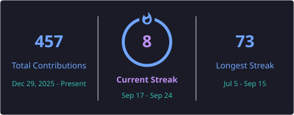
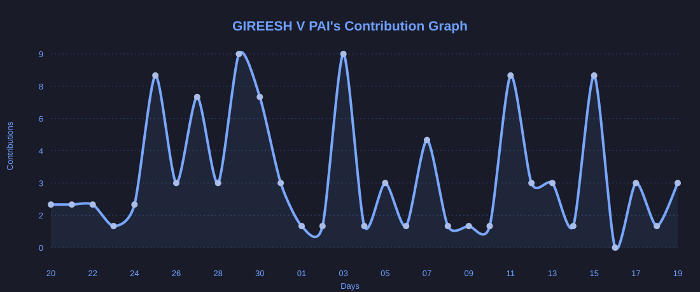
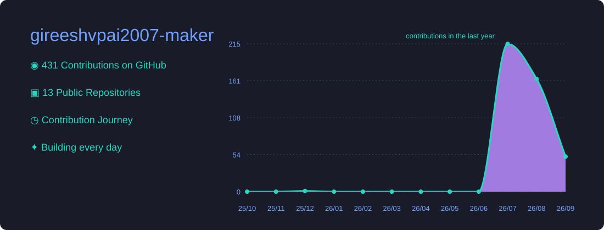

<div align="center">


<br>


<br><br>


<br><br>


<br><br>

✨ **[Try the interactive version →](https://gireeshvpai2007-maker.github.io/particle-intro)**

</div>

# 👋 Hello, I'm Gireesh

```cpp
class Gireesh {
public:
    string role = "Software Engineer in Progress";
    string university = "MIT Manipal";
    string degree = "B.Tech Computer Science";

    vector<string> languages = {
        "Java",
        "C++",
        "Python",
        "JavaScript",
        "SQL"
    };

    vector<string> interests = {
        "Software Engineering",
        "Data Structures & Algorithms",
        "AI / ML",
        "Data Analytics",
        "Medical Imaging Research"
    };

    string mission =
        "Build software, solve problems, and learn through research.";
};
```

---

# 💡 About Me

🎓 Computer Science student at **MIT Manipal**  
💻 Passionate about **Software Engineering, Algorithms, AI/ML, and problem-solving**  
🌳 Practicing **Data Structures & Algorithms** consistently, with a current focus on graph algorithms  
📊 Building projects in **Java, C++, Python, and Data Analytics** to apply what I learn  
🔬 Exploring **AI-driven medical imaging research**, especially 2D-to-3D reconstruction and algorithm development  
🚀 I prefer building and understanding systems from fundamentals rather than only following tutorials  

---

# 🔬 Research Focus

Currently exploring interdisciplinary research at the intersection of **Computer Science, Algorithms, AI/ML, and Medical Imaging**.

### Current Research Direction

- 2D → 3D reconstruction in medical imaging
- Computer vision and image processing
- Algorithm development and optimization
- AI/ML-assisted anatomical reconstruction
- Experimental evaluation and reproducible research

> 🚧 Research work is currently in progress. Project-specific unpublished details, datasets, and confidential research material are intentionally kept private.

---

# 🚀 Featured Projects

<table>
<tr>

<td width="50%" valign="top">

## ☕ StreamVault

A Java application demonstrating Object-Oriented Programming through a working media library and recommendation system.

### Concepts

- Generics
- Stream API
- Collections
- Enums
- Composition
- Factory Pattern


🔗 **Repository:** https://github.com/gireeshvpai2007-maker/OOP-Implementation

</td>

<td width="50%" valign="top">

## 💻 LeetCode Solutions

Daily LeetCode practice with clean, optimized C++ solutions and consistent GitHub commits.

### Topics

- Arrays
- Binary Search
- Trees
- Stack
- Queue
- Recursion
- Two Pointers


🔗 **Repository:** https://github.com/gireeshvpai2007-maker/LeetCode

</td>

</tr>

<tr>

<td width="50%" valign="top">

## 🌳 Data Structures & Algorithms

An interview-focused repository containing implementations and solutions in modern C++.

### Covered

- Arrays
- Strings
- Binary Search
- Trees
- Linked Lists
- Recursion
- Graph Algorithms
- Stack
- Queue


🔗 **Repository:** https://github.com/gireeshvpai2007-maker/DataStructures

</td>

<td width="50%" valign="top">

## 🚌 Vishnu Tours & Travels

A responsive website built for a real travel agency business, with WhatsApp enquiry integration and a modern UI.

### Features

- Responsive Design
- Dark Mode
- WhatsApp Enquiry
- Contact Form
- Modern UI


🌐 **Live:** https://vishnu-tours-travels.netlify.app

🔗 **Repository:** https://github.com/gireeshvpai2007-maker/Vishnu-Tours-Travels-Website

</td>

</tr>

<tr>

<td width="50%" valign="top">

## 📊 Data Visualisation

Python/Jupyter notebooks exploring real-world datasets through visualization, including sentiment analysis with word clouds.

<p align="center">

</p>

### Highlights

- Exploratory Data Analysis
- Word Cloud Generation
- Statistical Visualization
- Data Cleaning

<p>

</p>

<p>


</p>

🔗 **Repository:** https://github.com/gireeshvpai2007-maker/Data-Visualisation

</td>

<td width="50%" valign="top">

## 🤖 InsightAI *(In Progress)*

A business analytics tool that turns raw CSV datasets into visualizations and predictive insights using machine learning.

### Features

- Automated Data Visualization
- ML-based Predictions
- Interactive Dashboard
- Data Analysis Pipeline


🔗 **Repository:** https://github.com/gireeshvpai2007-maker/InsightAI

</td>

</tr>

<tr>

<td width="50%" valign="top">

## 🌐 freeCodeCamp Projects

Projects completed while earning Responsive Web Design and JavaScript certifications.

### Includes

- Responsive Websites
- CSS Projects
- JavaScript Challenges


🔗 **Repository:** https://github.com/gireeshvpai2007-maker/FreeCodeCamp

</td>

<td width="50%" valign="top">

## 🔬 MedVision-2D3D *(Research)*

A research repository exploring AI-driven **2D-to-3D reconstruction in medical imaging**, with a focus on algorithm development, experimentation, and evaluation.

### Research Areas

- Medical Image Processing
- 2D → 3D Reconstruction
- Computer Vision
- Algorithm Development
- AI / Machine Learning
- Experimental Evaluation


🚧 **Research in progress**

</td>

</tr>

</table>

---

# 🛠 Tech Stack

<p align="center">

</p>

---

# 📚 Currently Learning

```text
🧠 Dijkstra's Algorithm & Shortest Paths
🕸️ Graph Theory & Havel–Hakimi
📈 Kendall's Tau & Statistical Correlation
💡 Digital Systems & Computer Organization
🔬 AI / Medical Image Processing
⚡ Dynamic Programming
```

---

# 📊 GitHub Analytics

<div align="center">





<br><br>



<br><br>

<h2 align="center">📊 GitHub Activity</h2>

<p align="center">
  
</p>

<h2 align="center">🚀 Contribution Journey</h2>

<p align="center">
  
</p>

</div>

---

<div align="center">

<picture>
  <source
    media="(prefers-color-scheme: dark)"
    srcset="https://raw.githubusercontent.com/gireeshvpai2007-maker/gireeshvpai2007-maker/output/github-contribution-grid-snake-dark.svg"
  />

  <source
    media="(prefers-color-scheme: light)"
    srcset="https://raw.githubusercontent.com/gireeshvpai2007-maker/gireeshvpai2007-maker/output/github-contribution-grid-snake.svg"
  />

  
</picture>

<br><br>

<i>Code. Learn. Build. Research. Repeat.</i>

</div>
